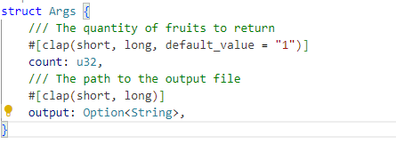
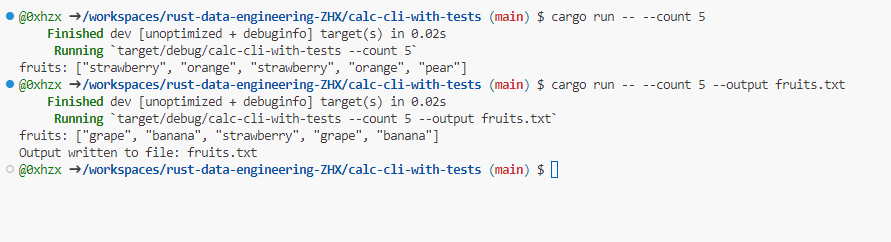
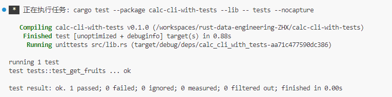

### Lab:  Modifying a Rust Command-Line Tool

In this lab you will gain experience extending an existing Rust project by forking and modifying a simple command-line tool.

**Steps**

1. Fork the repository at **https://github.com/nogibjj/rust-data-engineering**

2. Clone your forked repository 

3. Navigate to `calc-cli-with-tests` command-line tool projects

4. Add a new command line argument `output` to save the output of the program permanently

   - Run `cargo run -- --count 5 --output fruits.txt` can save the result into the file `fruits.txt`

5. Run `cargo build` to compile your changes  

6. Run `cargo run` to test your modified tool

7. Commit your changes and push to your forked repository


**Screenshots**
### New Args



### Run with more arguments


### Run Test



## Makefile

Each subdirectory project uses this style to make it easy to test and run

```
format:
	cargo fmt --quiet

lint:
	cargo clippy --quiet

test:
	cargo test --quiet

run:
	cargo run 

all: format lint test run
```


## References

* [Rust Collections](https://doc.rust-lang.org/std/collections/index.html)
* [GitHub Copilot CLI](https://www.npmjs.com/package/@githubnext/github-copilot-cli)
* [Rust Fundamentals](https://github.com/alfredodeza/rust-fundamentals)
* [Rust Tutorial](https://nogibjj.github.io/rust-tutorial/)
* [Rust MLOps Template](https://github.com/nogibjj/mlops-template)
